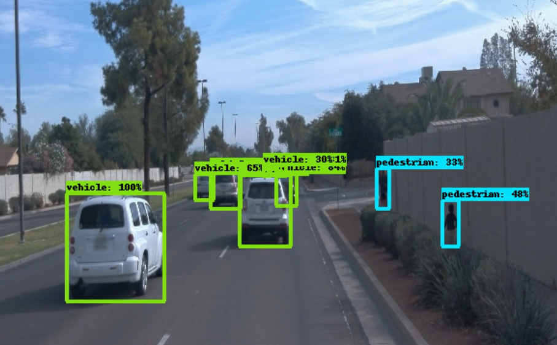
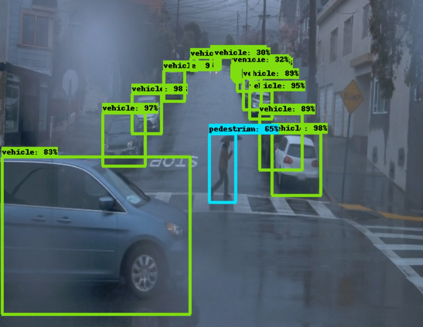

# Object Detection in an Urban Environment

## Project overview

Object detection techniques are indispensable parts for autonomous driving. Accurately detecting the surrounding objects can help autonomous vehicles react and prevent potential collisions. In this project, we use deep learning approaches to detect objects in urban environments. The [Waymo Open dataset](https://waymo.com/open/), which provides rich and yet various driving scenes, will be used to train our neural network models. We first analyze the data in Waymo Open dataset and split the data into training, validation and test sets based on the cross-validation method. And we perform the training and further improve the model with different strategies. 

| | |
|:---------------:|:---------------:|
| |  |

