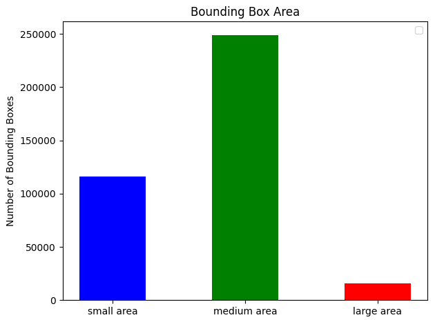

# Object Detection in an Urban Environment

## Project overview

Object detection techniques are indispensable parts for autonomous driving. Accurately detecting the surrounding objects can help autonomous vehicles react and prevent potential collisions. In this project, we use deep learning approaches to detect objects in urban environments. The [Waymo Open dataset](https://waymo.com/open/), which provides rich and yet various driving scenes, will be used to train our neural network models. We first analyze the data in Waymo Open dataset and split the data into training, validation and test sets based on the cross-validation method. And we perform the training and further improve the model with different strategies. 

| | |
|:---------------:|:---------------:|
| |  |

## Dataset

### Dataset analysis

The first step is to [download and process the dataset](README.md#download-and-process-the-data) to get necessary information for object detections in camera images. The new tfrecord format contains the image being resized to 640x640 and the bounding box information. The function of randomly displaying 10 images, as shown below, is implemented to check whether the image associated its corresponding bounding boxes and class labels are presented correctly.

Next, we take 18000 images from dataset for analyzing the the number of objects for each class, the number of bounding boxes, etc.  
In the image shown below, we can see the number of `car` are much more than `pedestrian` and `cyclist`. The main reason might be the fact that ega-car does not always drive in downtown, so not many people actually appear in the scene. The number of `pedestrian` and `cyclist` for training a model may not be sufficient.

Now we look at the statistics of driving scenes for daytime/night. Each image is converted to gray-scale image and the pixels' average value is calculated. If the average value is less than 50, we identify the image is taken at night. The results showed that the number of images taken in daytime is dominant, which make it more challenging for recognizing objects in the darker scenes.

Next, we analyze the bounding box's total count and the distribution of the bounding box sizes in images. As shown below, there are fair amount of images containing over 30 bounding boxes. It may imply that some of the objects are overlapped, which means only partial information is captured by the camera. The area of bounding box varies from less than 10 by 10 pixels (small area) to over 100 by 100 pixels (large area).

| | |
|:---------------:|:---------------:|
| |  |

